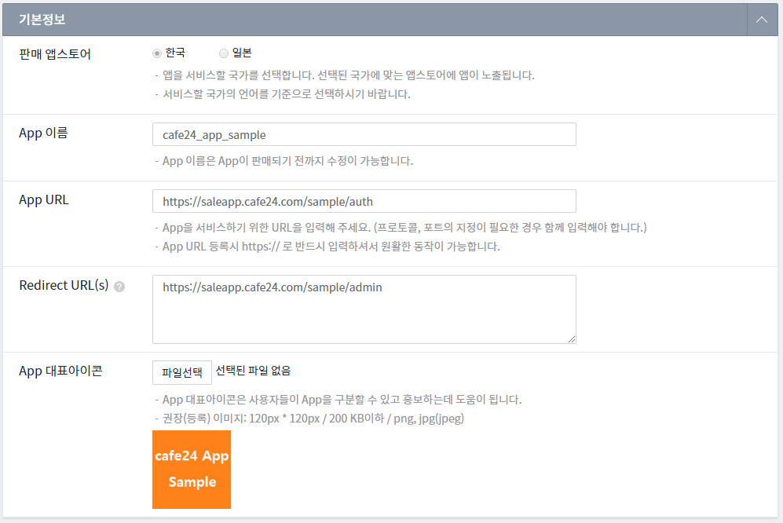

 App Sample
==============================

> #### 참조
>> cafe24 개발자 센터 : [developer.cafe24.com](https://developer.cafe24.com/)\
>> cafe24 앱 스토어 : [store.cafe24.com](https://store.cafe24.com/)

> 
>> Language : java 8 \
>> Framework : Spring boot 2.0.x \
>> 의존성 관리 : Maven 3.3.x

## 이용 방법
* 선행 조건 [개발자 센터](https://developer.cafe24.com/)에 가입후 앱을 등록한다.
    1. 기본정보 등록 ([App Guide](https://developer.cafe24.com/guide/front/intro?guide_no=47))
        
    
    2. 스코프 획득 ([Scope Guide](https://developer.cafe24.com/guide/front/develop?guide_no=58))
        
        
    3. 인증 정보 획득 ([Auth Guide](https://developer.cafe24.com/guide/front/develop?guide_no=74))
        

* 개발 환경 세팅
    1. 소스를 체크아웃 혹은 다운로드 받아서 STS, Eclipse, IntelliJ 등의 IDE에 Import 합니다.   

    2. 사용자 환경을 세팅합니다.(대괄호([] 영역 유효값으로 치환)
        * File : src\main\java\com\cafe24\app\discount\core\AppEnv.java
        ``` 
           //App key
           public static final String CLIENT_ID = "[App key]";//<-------------------------------- [App key] 수정
           //App secret key
           public static final String SECRET_KEY = "[Secre key]";//<-------------------------------- [Secre key] 수정
           //app Url
           public static final String APP_BASE_URL = "[App host]";//<-------------------------------- [App host] 수정
           //app retrun Url
           public static final String APP_RETURN_URL = "[App return url]";//<-------------------------------- [App return url] 수정
           //app scope
           public static final String APP_SCOPE = "[App scope]";//<-------------------------------- [App scope] 수정
        ```
     
* 배포
     1. Maven을 통해 빌드하여 tomcat 등의 WAS에 배포합니다. 
     
## 지원

cafe24 app_sample을 이용 중 버그를 발견하거나, 소스 코드에 대해 문의 사항이 있으면 [Issues](https://github.com/cafe24-app/app_sample/issues)에 등록해 주세요.
        